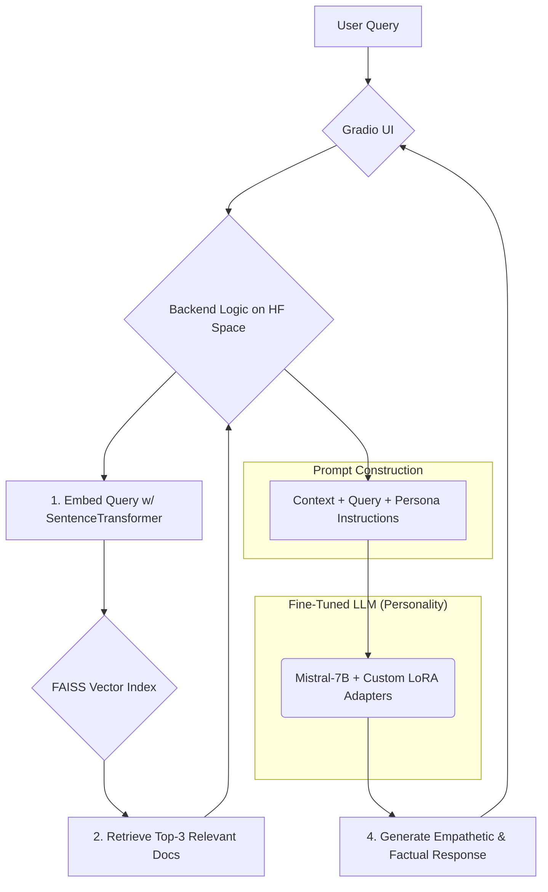

# August AI Coach 🩺

An empathetic and fact-based conversational AI for gut health, designed to provide supportive and easy-to-understand information. This project leverages a sophisticated RAG (Retrieval-Augmented Generation) pipeline, combining a fine-tuned language model for personality with a vector database for accuracy.

## ✨ Live Demo

➡️ **The link to the live demo will be added here after a successful deployment to Hugging Face Spaces.**

## 🌟 Key Features

* **Empathetic Personality**: Fine-tuned on a custom dataset of over 250 examples to ensure a warm, supportive, and non-judgmental tone, similar to the August AI persona.
* **Fact-Based & Accurate**: Utilizes a RAG pipeline to ground responses in a curated knowledge base, minimizing hallucinations and providing reliable information.
* **Curated Knowledge Base**: The AI's "brain" is built from trusted medical sources like Healthline, Mayo Clinic, and the NIH.
* **Optimized Performance**: The Mistral-7B model is fine-tuned using PEFT/LoRA and quantized to 4-bit precision, allowing for efficient inference on consumer-grade GPUs.
* **Interactive UI**: A clean and user-friendly chat interface built with Gradio.

## 🏗️ Architecture

This project uses a hybrid architecture to balance personality and factual accuracy. The user query is first used to retrieve relevant documents from a vector database (the "brain"), which are then passed as context to the fine-tuned LLM (the "personality") to generate a final response.



❤️ Fine-Tuning for Personality
While the RAG pipeline provides the factual "brain" for the AI, a distinct personality was required to meet the project's goal of being an empathetic coach. To achieve the specific "August AI" tone, the base Mistral-7B model was fine-tuned.

The process involved:

Curated Dataset Creation: A custom tone_dataset.json file was manually created, containing over 250 high-quality examples of instruction/response pairs that exemplify the desired supportive and gentle tone.

Efficient Fine-Tuning with PEFT/LoRA: To avoid the massive computational cost of fully fine-tuning a 7-billion-parameter model, Parameter-Efficient Fine-Tuning (PEFT) was used. Specifically, the Low-Rank Adaptation (LoRA) technique was employed. LoRA works by freezing the pre-trained model weights and injecting small, trainable rank-decomposition matrices (called adapters) into the layers of the model.

The Result: This process generated the lightweight lora_model_fixed adapters. When loaded on top of the base model, these adapters steer the AI's responses to match the empathetic personality defined in our custom dataset, without compromising the model's core linguistic capabilities.


## 🛠️ Technology Stack

* **LLM**: [Mistral-7B-Instruct-v0.2](https://huggingface.co/mistralai/Mistral-7B-Instruct-v0.2)
* **Fine-Tuning**: PEFT (LoRA), Unsloth, Transformers
* **RAG Pipeline**: LangChain, Sentence-Transformers, FAISS
* **Backend & UI**: Gradio
* **Deployment**: Hugging Face Spaces (with T4 GPU)
* **Data Processing**: Pandas, BeautifulSoup

## 🚀 Local Setup and Installation

To run this project on your own machine, you'll need an NVIDIA GPU with at least 8GB of VRAM.

1.  **Clone the repository:**
    ```bash
    git clone <your-repository-url>
    cd <your-repository-name>
    ```

2.  **Create and activate a virtual environment:**
    ```bash
    python -m venv venv
    # On Windows
    .\venv\Scripts\Activate
    # On macOS/Linux
    source venv/bin/activate
    ```

3.  **Install the required dependencies:**
    ```bash
    pip install -r requirements.txt
    ```

4.  **Run the application:**
    ```bash
    python app.py
    ```
    The Gradio interface will be available at a local URL (e.g., `http://127.0.0.1:7860`).

## 📁 Project Structure

```
.
├── lora_model_fixed/       # Directory for the fine-tuned LoRA adapters
├── .gitignore              # Specifies files for Git to ignore
├── app.py                  # The main Gradio application script
├── fix_json.py             # Utility script to format the knowledge base
├── knowledge_base.csv      # Raw scraped text data
├── knowledge_base_corrected.jsonl # Final knowledge base with embeddings
├── README.md               # You are here!
└── requirements.txt        # Python dependencies
```

## 🧠 Challenges & Learnings

This project involved several real-world challenges and strategic pivots:

* **GCP GPU Quota Limitation**: The initial plan was to deploy on Google Cloud's Vertex AI. However, a common free-tier limitation prevented access to GPU resources.
* **Strategic Pivot to Hugging Face**: We adapted by moving the entire deployment to Hugging Face Spaces, which provides free T4 GPU access. This pivot demonstrated adaptability and proficiency with modern AI/ML platforms.
* **Data Integrity**: Discovered that the initial knowledge base JSON file contained embeddings but was missing the corresponding text. A custom Python script (`fix_json.py`) was written to merge the source text with the embeddings, correcting the data pipeline and ensuring the RAG system's success.

## 📄 License

This project is licensed under the MIT License.